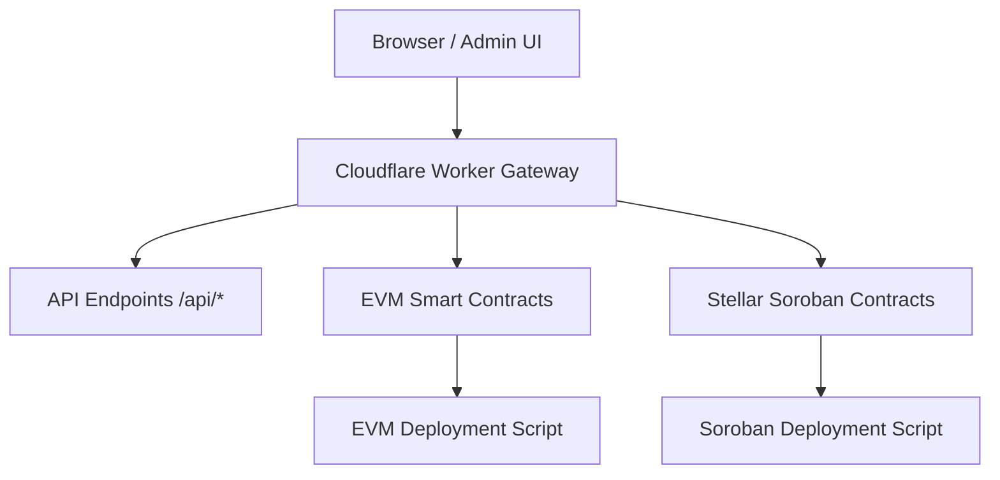

# Open-Stellar System Architecture

This document provides a high-level overview of the Open-Stellar architecture, mapping protocol modules to their smart contracts, API endpoints, test suites, and deployment workflows.



---

## 1. Escrow & Milestone Management

Handles decentralized funds holding, milestone release, and dispute resolution across Stellar and EVM chains.

* **Soroban Contract:** [`StellarEscrow`](../contracts/StellarEscrow.md) &rarr; Source: [`contracts/stellar/escrow/src/lib.rs`](../../contracts/stellar/escrow/src/lib.rs)
* **EVM Contract:** [`EscrowMilestone`](../contracts/EscrowMilestone.md) &rarr; Source: [`contracts/evm/EscrowMilestone.sol`](../../contracts/evm/EscrowMilestone.sol)
* **API Endpoints:**
  * `POST /api/stellar/build-tx` &rarr; [`app/api/stellar/build-tx/route.ts`](../../app/api/stellar/build-tx/route.ts)
  * `GET /api/explorer/receipts` &rarr; [`app/api/explorer/receipts/route.ts`](../../app/api/explorer/receipts/route.ts)
* **Test Suites:**
  * [`__tests__/api/stellar/build-tx.test.ts`](../../__tests__/api/stellar/build-tx.test.ts)
* **Deployment Workflow:**
  * EVM Guide: [`scripts/deploy/evm/guide.mjs`](../../scripts/deploy/evm/guide.mjs) (`npm run deploy:evm:guide`)
  * Soroban Guide: [`scripts/deploy/soroban/guide.mjs`](../../scripts/deploy/soroban/guide.mjs) (`npm run deploy:soroban:guide`)

---

## 2. Service Paywall (x402 Protocol)

Implements web3 HTTP 402 Payment Required mechanism for agent and microservice monetisation.

* **EVM Contract:** [`X402ServicePaywall`](../contracts/X402ServicePaywall.md) &rarr; Source: [`contracts/evm/X402ServicePaywall.sol`](../../contracts/evm/X402ServicePaywall.sol)
* **API Endpoints:**
  * `GET /api/protocol/x402` &rarr; [`app/api/protocol/x402/route.ts`](../../app/api/protocol/x402/route.ts)
  * `POST /api/protocol/x402` &rarr; [`app/api/protocol/x402/route.ts`](../../app/api/protocol/x402/route.ts)
* **Test Suites:**
  * [`__tests__/api/protocol/x402.test.ts`](../../__tests__/api/protocol/x402.test.ts)

---

## 3. Reputation & Track 8004 Fallback

Fallback protocol for agent reputation scoring on Stellar when Track 8004 is unavailable.

* **Architecture Docs:** [`contracts/stellar/REPUTATION_FALLBACK.md`](../../contracts/stellar/REPUTATION_FALLBACK.md)
* **API Endpoints:**
  * `GET /api/protocol/reputation` &rarr; [`app/api/protocol/reputation/route.ts`](../../app/api/protocol/reputation/route.ts)
  * `POST /api/protocol/reputation` &rarr; [`app/api/protocol/reputation/route.ts`](../../app/api/protocol/reputation/route.ts)
* **Test Suites:**
  * [`__tests__/api/protocol/reputation.test.ts`](../../__tests__/api/protocol/reputation.test.ts)

---

## 4. Updating Contract & API Documentation

When altering public contract functions or data structures:

1. Update the contract code in `contracts/*/src/` or `contracts/evm/`.
2. Run the doc generation shortcut:
   ```bash
   npm run docs:generate
   ```
3. Verify updated files in `docs/contracts/` and check CI validity:
   ```bash
   npm run docs:check
   ```
